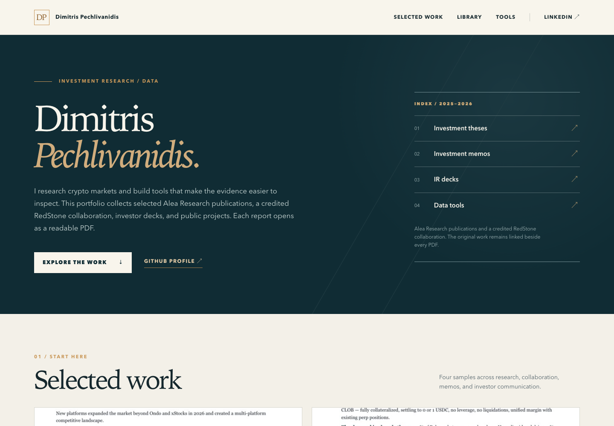

# Dimitris Pechlivanidis — research portfolio

A static, PDF-first portfolio prepared for GitHub Pages. The public site is in
`docs/`; the source-to-PDF builders are in `scripts/`.



## Preview

```bash
python3 -m http.server 8765 --directory docs
```

Open `http://localhost:8765/`. The site itself has no build step, framework,
cookies, or analytics.

## Rebuild PDFs and index

Install the packages in `requirements.txt`. Install Playwright Chromium with
`python3 -m playwright install chromium`, or set `PORTFOLIO_CHROME` to a local
Chrome executable. On macOS, the scripts use `/Applications/Google Chrome.app`
when present.

```bash
python3 scripts/build_articles.py
python3 scripts/build_redstone.py
python3 scripts/build_decks.py
python3 scripts/optimize_pdfs.py
python3 scripts/build_site.py
python3 scripts/check_site.py
```

The scripts fetch the public source pages. Article PDFs reformat the published
text and figures, retain outbound source links, and add a personal cover with
the original publisher and date. They do not update old market views. The
RedStone PDF includes only the ecosystem chapter credited to Dimitris on the
source page. Deck PDFs capture every slide from the public Figma audience
view; their slide pages are high-resolution images, so the original deck link
remains available alongside the PDF.

## Publishing

The intended GitHub Pages repository is `0xDimi/0xDimi.github.io`, with `docs/`
as the branch publishing source. Review the
PDFs, site copy, and publication rights before pushing them to a public repo.
The current work stays local until that review is complete.

## Attribution

Alea Research retains its credit on the Alea reports and decks. The RedStone
report credits Dimitris as a core contributor and names him on the ecosystem
chapter. Portfolio covers identify the original publisher and link to the
canonical publication. This portfolio does not imply sole authorship of team
research.
